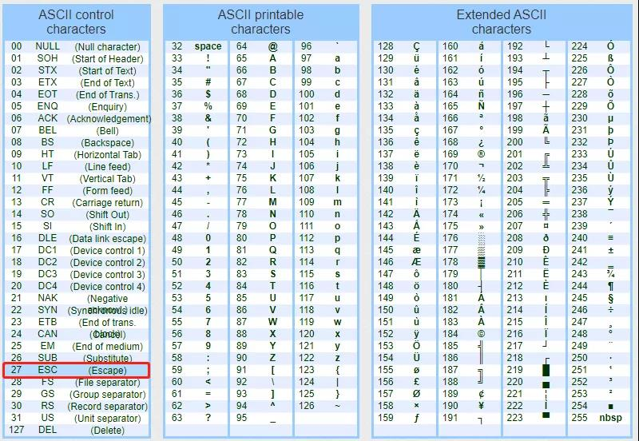
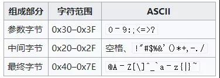

## ANSI转义序列

https://mp.weixin.qq.com/s/8byBGYgx8nEXb678lzMcYA

ANSI转义序列（ANSI escape sequences）是一种带内信号的转义序列标准，用于控制视频文本终端上的**光标位置**、**颜色**和**其他选项**。在文本中嵌入确定的字节序列，大部分以`ESC转义字符`和`"["字符`开始，**终端会把这些字节序列解释为相应的指令，而不是普通的字符编码**。

所以这里我们查了一下`ascii`码表，可以发现`ESC`的码值是十进制的`27`，也就是十六进制的`0x1b`，具体如下所示；

ascii码表

所以转义序列的格式如下；



可以参考文档:`https://invisible-island.net/xterm/ctlseqs/ctlseqs.html`

所以这里简单举个例子，设置不同的背景色；

```c
#include <stdio.h>

int main(){

        for(int i = 0; i < 256; i++){

                printf("\x1b[48;5;%dm %03d \x1b[0m", i, i);

                if( i % 10 == 0){
                        printf("\r\n");
                }
        }
        return 0;
}
```

重点是这一句：`printf("\x1b[48;5;%dm %03d \x1b[0m", i, i);`简单分析一下；

- 其中`\x1b[` 是起始指令，后面的`48`表示设置背景色，`38`是前景色；
- 48后面通常会跟一个`;5;`，这个是文档中规定的，第一个`%d`，是设置色号，最后以`m`结尾；

|       |            |                                      |
| ----- | ---------- | ------------------------------------ |
| 38    | 设置前景色 | 下一个参数是`5;n`或`2;r;g;b`，见下。 |
| 39    | 默认前景色 | 由具体实现定义（按照标准）。         |
| 40-47 | 设置背景色 | 参见下面的颜色表。                   |
| 48    | 设置背景色 | 下一个参数是`5;n`或`2;r;g;b`，见下。 |

参数设置

- 第二个`%03d`是中间需要显示的文本；
- 最后以`\x1b[0m`结束；

